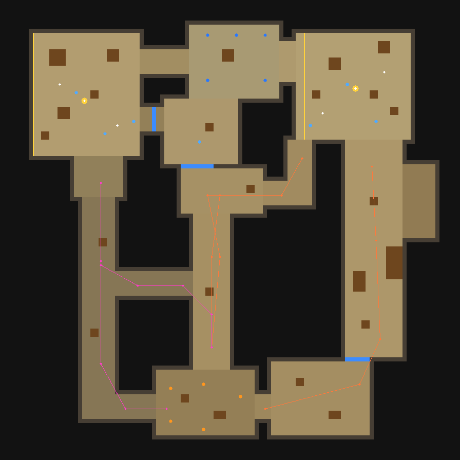

# Dust2 5v5 — 浏览器第一人称射击原型

React 18 + TypeScript + three.js (r160) + Vite。**没有任何外部资产**：地图、角色、武器全部由代码用几何体程序化生成，所有声音由 Web Audio 实时合成；除 `three / react / react-dom` 外没有其它运行时依赖，寻路、状态机、物理、渲染循环全部自研。

```bash
npm install
npm run dev        # 打开 http://localhost:5173 ，点「开始游戏」
```

## 玩法与操作

| 键 | 作用 |
|---|---|
| W A S D / Shift / 空格 | 移动 / 静步（无脚步声）/ 跳跃（可跳上 ≤1.5 m 的箱子） |
| 鼠标（指针锁定）/ 左键 | 转视角 / 开火（半自动枪需逐次点击） |
| 右键 | AWP 开镜（再点一次切换第二倍率，第三次关镜）；刀：重刺 |
| R / 1 2 3 / Q / 滚轮 | 换弹 / 主·副·刀 / 切回上一把 / 循环切枪 |
| E（按住） | T：在 A 点或 B 点安放 C4；CT：在已安放的 C4 旁拆除 |
| B + 数字键 | 冻结时间内购买（Desert Eagle / 步枪 / AWP / 防弹衣 / +头盔 / 拆弹器） |
| Tab | 记分板 |
| 阵亡后：点击 / F | 切换观战队友 / **接管**该队友（bot）继续操控 |
| Esc | 释放鼠标（暂停），点击画面恢复 |

菜单可选阵营（CT / T）与开局模式：

* **手枪局**：全员只有默认手枪（CT: USP-S，T: Glock-18）+ 刀，$800，无主武器、无护甲（可买防弹衣 $650 / 沙鹰 $700）。配置见 `sim/config.ts` 的 `ROUND_MODES`。
* **全装局**：$10000 + 护甲头盔，可直接买 AK-47 / M4A4 / AWP 体验所有枪。

先赢 8 个回合获胜。回合：冻结 9 s → 进行 115 s → 结算 5.5 s；安放 3.2 s，炸弹 40 s，拆除 10 s（有拆弹器 5 s）。

## 需求对照

| 需求 | 实现位置 |
|---|---|
| Dust2：T/CT 出生点、A大、A点、中门（可开合门体）、猫道、B洞、B点，彼此连通，墙/箱子有碰撞 | `sim/map.ts`（矩形数据）→ `sim/world.ts`（碰撞）；`scripts/check-map.ts` 验证所有区域从 T 出生点可达 |
| 类人角色：独立头/躯干/双臂/双腿，CT/T 一眼可分，持枪 | `render/characterModel.ts`（全部 `BoxGeometry`，无胶囊/圆柱）；CT 深蓝制服+头盔，T 土黄制服+红色面罩 |
| 武器数据系统 + 第一人称手持模型 | `sim/weapons.ts`（一张数据表）、`render/weaponModels.ts`、`render/viewmodel.ts` |
| AK 高伤害强后坐；M4 中伤低后坐高射速；AWP 单发致命 + 右键开镜（3D 拉近 + 2D 遮罩）；Glock/USP/沙鹰；刀 | 数值在 `weapons.ts`；后坐/散布在 `sim/combat.ts`；开镜 FOV 在 `render/renderer.ts`，遮罩 `ui/Hud.tsx` `Scope` |
| Hitbox 分区（头/胸/腹/臂/腿），爆头 = 2× 身体，护甲减伤 | `sim/hitbox.ts`（OBB 射线）、`combat.ts::applyDamage`、`CFG.*_MULT` |
| 手枪局 | `ROUND_MODES.pistol`，`GameSim.newRound` |
| C4：随机 T 持包 → 阵亡掉落 → 他人拾取 → 站点安放 → CT 拆除 → 胜负结算 | `sim/game.ts` `updateBomb / plantBomb / updateDefuse / explode / endRound` |
| 5v5：1 玩家 + 4 AI 队友 vs 5 AI；寻路巡逻、视线索敌（墙挡视线）、交战、参与下包/拆包 | `sim/ai.ts`（状态机）、`sim/nav.ts`（A*）、`GameSim.computeSight`（射线视线 + 视锥） |
| 玩家阵亡 → 观战/接管 bot | `GameSim.cycleSpectate / takeover` |
| 第一人称控制、HUD、准星扩散、弹药面板、Killfeed、小地图（自己/队友/被看见的敌人/C4） | `runtime/runtime.ts`、`ui/*` |
| 程序化音效 | `runtime/audio.ts`：各枪开火声、换弹、脚步、开镜、命中/爆头反馈、C4 安放/嘀嗒/拆除/爆炸、击杀提示、开关门等，带距离衰减与左右声像 |

## 地图俯视图

`docs/map-topdown.png`（`node scripts/render-map-png.ts docs/map-topdown.png` 生成）：蓝点 = CT 出生/站位，橙点 = T 出生，橙/粉线 = T 进攻路线，蓝色短线 = 门，黄圈 = 包点。



## 架构

```
┌────────────────────────── React (ui/*) ─────────────────────────────┐
│ Menu · Hud · Minimap · BuyMenu · Scoreboard ...  读 HudState 快照     │
└───────────────▲──────────────────────────────────────────────────────┘
                │ useSyncExternalStore（~20 Hz 发布不可变快照 + 事件时刷新）
┌───────────────┴──────────── runtime/runtime.ts (GameRuntime) ────────┐
│ rAF 循环：输入 → 固定 60 Hz sim.update() → 事件分发 → 渲染(插值 alpha)  │
└───┬───────────────────────────┬───────────────────────┬──────────────┘
    │                           │ SimEvent              │
┌───▼──────── sim/* ────────┐ ┌─▼─ render/* (three) ─┐ ┌▼ runtime/audio.ts ┐
│ 纯 TS，不依赖 DOM/three    │ │ 只读 sim 状态 + 事件  │ │ Web Audio 合成     │
│ GameSim 回合/经济/C4/门    │ │ 地图、角色、手持模型  │ └───────────────────┘
│ World 碰撞·射线            │ │ 曳光/弹孔/血雾/C4     │
│ NavGrid A*                 │ └──────────────────────┘
│ BotBrain 状态机            │
│ combat 武器·后坐·伤害      │
└────────────────────────────┘
```

* **模拟与渲染完全解耦**：`src/sim` 不 import three/DOM，固定步长 1/60 s，可在 Node 里无头运行（见下）。渲染用 `alpha = acc/TICK` 在最近两步之间插值；视角（鼠标）直接写入 actor，不经过固定步，保证操作跟手。
* **React 不在帧路径上**：游戏循环在 React 之外，只把 HUD 快照放进 `hudStore`；小地图用独立 canvas + 50 ms 定时器直接读 sim。
* **碰撞**：地图格点 → 合并成 ~100 个 AABB 墙；圆柱体 vs AABB 推出（可滑墙）、台阶/箱顶站立、重力与跳跃；门是动态 AABB（开到 60% 以上失效）。射线（子弹/视线）与碰撞共用同一世界。
* **寻路**：1 m 网格，圆形体型可通过性 + 近墙惩罚的 A*，再做 string-pulling；卡住检测（0.7 s 位移 <0.3 m → 重新寻路/侧移/兜底传送）。
* **AI 状态机**：`wait / route / plant / postplant / fetch / hold / retake / defuse / seek / combat`；团队计划（T 战术：A执行、A大压制、B洞冲、分推；CT 站位与信息转点）；反应时间、瞄准速度、瞄准误差、爆发点射节奏、拉枪、AWP 开镜；听声（枪声/脚步）与队友报点；bot 自动购买。
* **武器**：数据驱动（伤害、护甲穿透、距离衰减、射速、自动/半自动、弹匣、换弹、移动速度、散布曲线、后坐参数、开镜、近战参数）。新增武器 = 在 `WEAPONS` 加一条 + 在 `weaponModels.ts` 加模型。

## 验证（无需浏览器）

`src/sim` 是纯 TypeScript，Node ≥ 22.18 可以直接跑（原生类型剥离）：

```bash
npm run verify        # 地图连通 + 77 项规则断言 + 运行时冒烟测试
npm run check:map     # 所有区域/路线/出生点/包点可达，墙挡射线，关闭的中门挡路
npm run test:rules    # 命中分区/爆头2×/护甲/AWP一枪/手枪局配置/掉包拾包/下包拆包爆炸/胜负/观战接管/碰撞
npm run sim -- 8 pistol 42   # 10 个 bot 无头打完整场比赛
npm run balance       # 蒙特卡洛：批量跑回合看双方胜率
npm run check:stuck   # 统计 bot 移动中长时间原地不动
npm run smoke         # 用 three/DOM 桩跑通 runtime + renderer 全流程（见下方说明）
```

## 已知限制 / 说明

* 这个仓库是在**没有 npm 网络访问**的环境里写成的：`three / react / vite` 没有被安装过，因此 **WebGL 渲染、React UI、音频在真实浏览器里没有被运行过**，视觉效果（模型比例、手持模型位置、光照亮度、HUD 排版）未经肉眼确认；`tsc` 类型检查也没有运行过。`npm run smoke` 只是用桩对象证明我们自己的渲染/运行时代码路径不会抛异常，并不能证明 three 的实际画面正确。第一次 `npm run dev` 时如果发现画面/位置需要微调，主要集中在 `render/weaponModels.ts`（`VIEW_POSE`）、`render/characterModel.ts`、`render/renderer.ts`（灯光强度）与 `ui/styles.css`。
* 模拟层（地图/碰撞/寻路/武器/AI/回合/C4）在 Node 中经过上述脚本验证。Bot 强度是「中等偏弱」的平衡：批量测试中手枪局 CT 胜率约 30–35%（T 集体进攻的数量优势），可在 `sim/ai.ts` 顶部的个性参数与 `map.ts` 的站位/战术表里调整。
* 地图是「Dust2 核心区域」的简化复刻（全部为 1 m 网格上的矩形），拓扑与走位关系按 Dust2 设计，尺度约 100 m × 100 m；没有高低差/斜坡，没有 B 窗、下水道细节。
* 没有蹲伏、没有投掷物、没有穿墙子弹、没有友军伤害；炸弹爆炸伤害仅按距离衰减（不计遮挡）。
